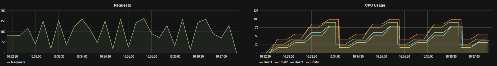
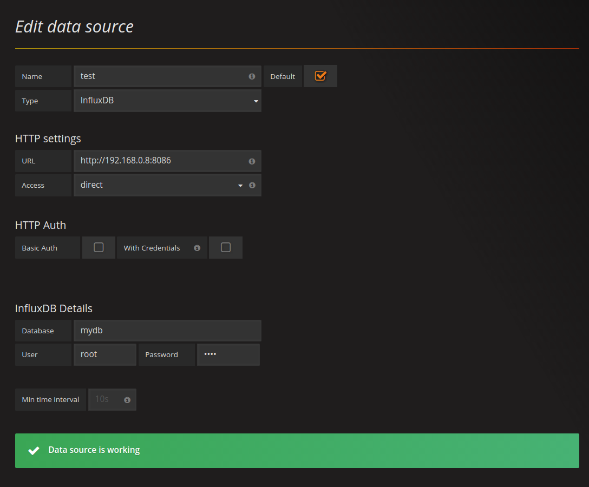
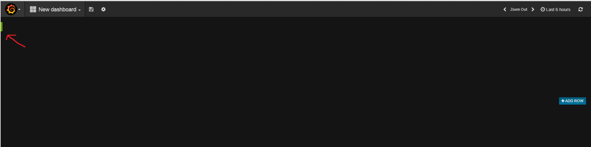
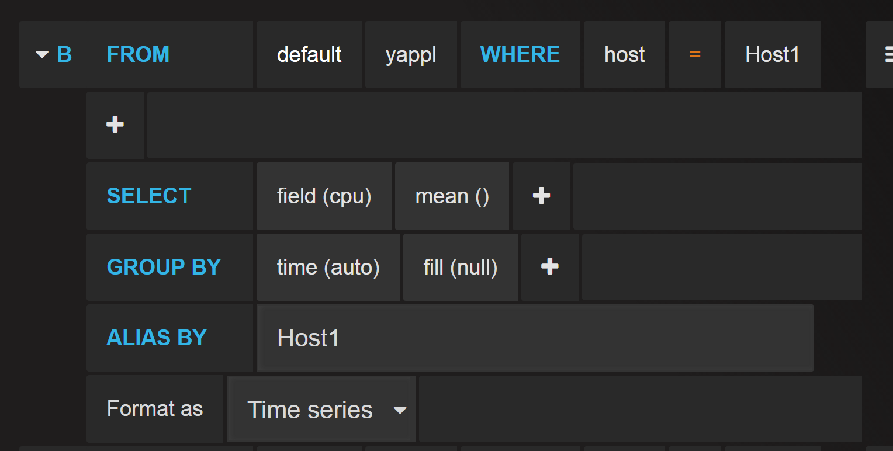
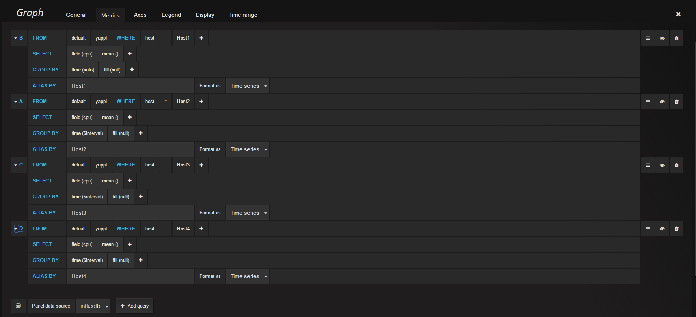
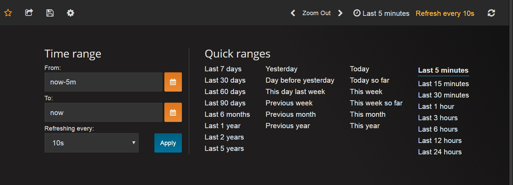
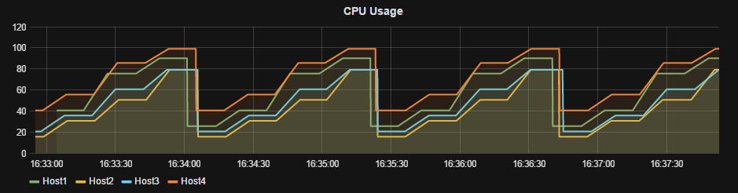
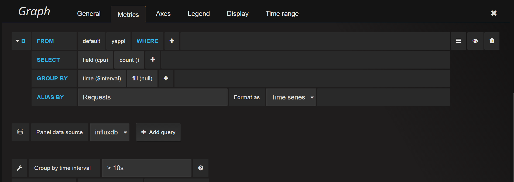
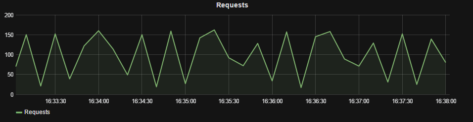

The purpose of this post is to show how one can use InfluxDB and Grafana to monitor systems. 
Down below is how the final output looks like. One graph showing the total requests of the system and the other, CPU of imaginary hosts.

**Agenda**:

1. Brief introduction of InfluxDB and Grafana
2. Setting up InfluxDB and Grafana using Docker
3. Running the Scala application
4. Sending data to InfluxDB
5. Creating graphs in Grafana

### InfluxDB

InfluxDB is an open source time series database. It's useful for recording metrics, events, and performing analytics.

### Grafana

Grafana is an open source metrics dashboard and graph editor for several data sources such as Graphite, Elasticsearch, OpenTSDB, Prometheus and InfluxDB

### Setting up InfluxDB and Grafana

Both InfluxDB and Grafana will be set up using their respective offical docker image. If you don't know what Docker is then I would recommend to check it out.

[Docker](https://www.docker.com/)

The commands below assume you have Docker installed.

**Running the InfluxDB container:**

    docker run --restart=always -d -p 8083:8083 -p 8086:8086 \
    -v $PWD:/var/lib/influxdb \
    influxdb:1.3.2

What the command above does is that it will first download the offical InfluxDB image from the public docker repository. After that it will start the container using the download image. 
Port 8086 is one of the ports exposed from inside the container, it is the HTTP API port which requests are sent to.

    -p 8086:8086

The port on the right side is the port used on the inside of the container and on the left side is which port we can access it on the outside. 
We could have used another random port instead of 8086 on the left side.

    -v $PWD:/var/lib/influxdb

Here we attach a data volume to the container. $PWD translates into the current directory that you are in, so smartest would be to create a InfluxDB directory somewhere. 
Make sure that you are running the docker command while inside it. This volume flag works similar as the port one. 
The data inside the container at path /var/lib/influxdb will be mounted to $PWD on the outside of the container. 
This allows us to have persistent storage in case the container dies etc..

Now before moving on to Grafana, let's create a database in InfluxDB.

    curl -i -XPOST http://localhost:8086/query --data-urlencode "q=CREATE DATABASE mydb"

**Running the Grafana container:**

    # Create /var/lib/grafana as persistent volume storage
    docker run -d -v /var/lib/grafana --name grafana-storage busybox:latest

    # Running Grafana
    docker run --restart=always -d -p 3000:3000 \
    --name=grafana --volumes-from grafana-storage \
    grafana/grafana

The Grafana container will also use a persistent volume, but it is configured differently, I will not go into details on it.

After the container is running you should be able log into Grafana at your-ip:3000. Default username and password is admin. 
First thing that needs to be done is to add InfluxDB as the default data source. 
Make sure to replace 192.168.0.8 with your own IP. User and Password is root.

### Running the REST API

The REST API is created using Akka HTTP, to run the application you will need Scala's SBT(Simple Build Tool). 

[Github repository can be found here](https://github.com/Max-Meldrum/influxdb-grafana-scala-example)

Running it in the terminal:
    
    # Needs to be executed in the folder where build.sbt resides
    sbt run

If you are running InfluxDB on another computer, then you can send the IP of the host as an argument:

    sbt "run 192.168.0.8"

Another option is to open the project in a IDE such as intellij IDEA. Just make sure that you have everything installed.

If you see the line "Starting up server at localhost:8080" then you should be good to go. To verify that it works, execute this curl command.

    curl -H "Content-Type: application/json" -X POST -d '{"hostName":"test", "cpu":0.00}' http://localhost:8080/dump

### Sending data into InfluxDB

In the project repository there is a folder called scripts. Inside it there are 4 shell scripts that continuously send requests to the REST interface and forwards it to InfluxDB.
Open up 4 terminals and start each respective script.

### Configuring Grafana to show the graphs

Head over to the Grafana interface again. It is time to create a dashboard. On the left side you should be able to see a little green box, 
if you hover over it and click that you should be able to see an option called Add Panel. Click on it and choose Graph. Click on the Panel Title and you should be able to see an Edit option. 

Give the title "CPU Usage" to the graph. Next go to the metrics tab, then make sure that Panel data source is selected as influxdb. Next step is to add queries that Grafana will perform against InfluxDB. Down below is how the first query should be configured, then simply just add 3 others and make sure that the correct Host is chosen. (Host1, Host2, ...)

If you are wondering what MEAN() is then look no futher, MEAN() returns the arithmetic mean(average) of the specified column over a given interval.

When you have added the 4 queries then it should look like something like the image below.

Up in the right corner of Grafana you can set the time ranges. Best is to try them around. I can recommend enabling auto refresh, in the image it is set to 10s.

Hopefully now you should see something popping up in your graph. This is how mine looked after the scripts had been running for a few minutes. The graph will of course look different depending on the time interval you have choosed.

**Creating a graph that shows the requests coming in to the system:**

First repeat the same step as before and add a another graph to the panel. Then head to the metrics tab and add this query.

The results should look something like this.

### Finishing words

As you can see, InfluxDB and Grafana is a very neat approach for monitoring your applications.

/ Max

