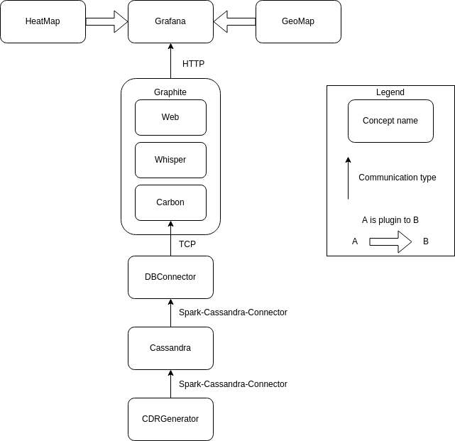
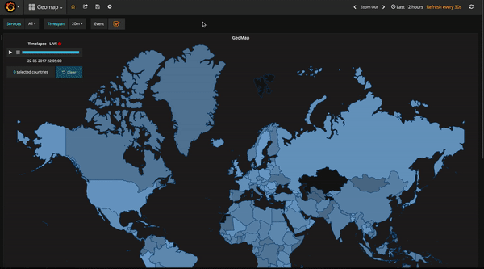
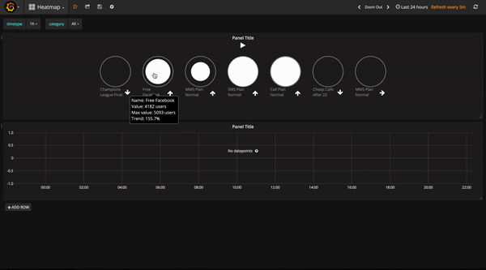

[orcD](https://github.com/qvantel/orcd) is a proof of concept project that was conducted by me and 14 other third year students at Blekinge Institute of Technology.
We were assigned this task by Qvantel as they wanted to look into the possibilties of how to visualize CDR's (Call Detail Record) on a heat and world map.
Qvantel is a leading global provider of cloud-based Business Support Solutions (BSS).

*Pictures in this post are not soley made by me*

### Architecture

To shortly explain the pipeline. We created an application (CDRGenerator) that generated CDR's and sent it to a database storage, in this case Cassandra. 
Then another system was utilised to fetch the records from Cassandra and push these into a time-series database. As Qvantel were using Graphite in production, they preferred us to use it as well.
Finally, Grafana was used to visualize statistics regarding the CDR's.

### GeoMap

The GeoMap Grafana plugin that was made by the team is used to visualize CDR's which have a roaming status.

### Heatmap

The task of the Heatmap is to visualize CDR's that are tied to a product/event. One of the examples used in the project was the champions league final. 
Where there was an offer out that no charging would be made during the final.

### Finishing words

It was a fun project, and working in a 15 man team was surely challenging, but in the end we were very successful.

Thumbs up to Qvantel that decided to make our project open-source.

/ Max

