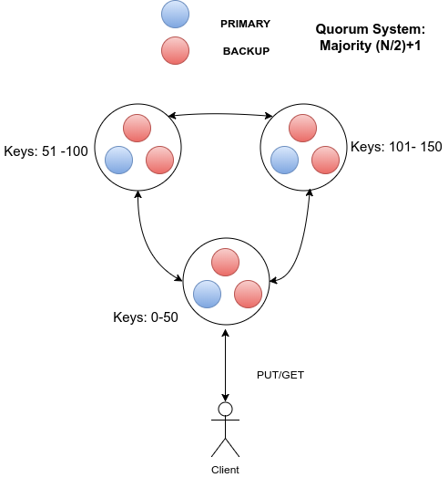
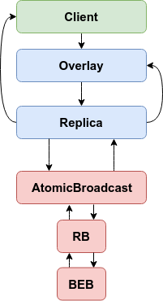

---
During the course ID2203 Distributed Systems Advanced course at KTH, myself and a classmate were tasked to implement an in-memory distributed key-value store with
linearizable semantics using the Kompics programming model. Kompics is a message-passing component model for building distributed systems. It was created at KTH/SICS.

We were free to choose any type of replication protocol. We thought it would be interesting to base the system on Zab (ZooKeeper Atomic Broadcast),
instead of the project's default choice, which was Paxos.

I will not go into full details of the project in this post. The final report can be found [here]({{ site.url }}/assets/files/id2203_report.pdf) and the project is hosted on [Github](https://github.com/Max-Meldrum/id2203-project).

## Overview

The key-value store is portioned based on the key-space with each partition
responsible for a particular key range. The partitions constitute a 
replication group i.e., each partition consists of a primary and its backups. The
replication groups are responsible for handling client requests and providing
linearizable operation semantics.

To ensure consistency across all replicas in a certain
replication group, we use a primary-backup scheme and implement an Atomic
Broadcast protocol that is heavily inspired by Zab which ZooKeeper relies on.

## Kompics Components

In the above figure, we show the relationships between the most important Kompics
components in our system. The client initially connects with a bootstrap
server, it then forwards the request to an overlay which checks which partition
should be handling the request. If the current replica is in the group, the
overlay forwards the request to the Replica component. If the current replica
is not involved with the partition, it routes the request to any of the replicas
in the replication group responsible for the partition.

# Conclusion

This project was meant to introduce the abstractions in the course, it is not a full-fledged production system. The Zab implementation is only a partial one
, it does not include its synchronizing phase and the leader election is not an optimal one.

Future work could be to fully implement Zab and run comparisons with other Zab implementations that do not utilise Kompics.

