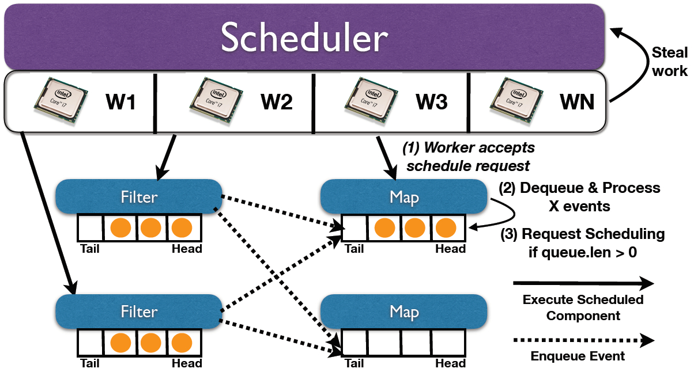
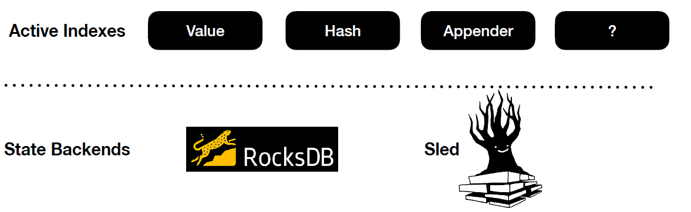
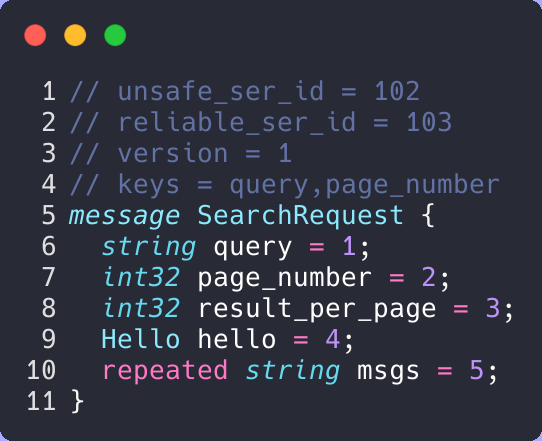

# Overview

2020 has been a strange year. In the early part of the year, the covid siutation combined with some personal issues definitely impacted my motivation and
productivity. I am writing this post to give an update on the state of Arcon, but also to let other PhD students know that they are not alone if they have struggled this year.

**Arcon** is a streaming-first analytics engine built in Rust that is a part of the Continuous Deep Analytics project at KTH & RISE.
Arcon is meant to be used either through the [Arc](https://github.com/cda-group/arc) programming language or directly through the raw Rust [project](https://github.com/cda-group/arcon).
 

*   [Threading Model](#threading-model)
*   [State Management](#state-management)
*   [Networking](#networking)
*   [Data Format](#data-format)
*   [Memory Management](#memory-management)

## Threading Model

At the core of Arcon is the hybrid component + actor model framework [Kompact](https://github.com/kompics/kompact). Arcon does not use dedicated threads, but rather relies 
on the workstealing scheduler of Kompact to drive the execution of the pipeline.

A Node is a Kompact component that contains a user-defined Arcon Operator. 
An Operator may either be stateless or stateful. More on how state is handled is discussed in
[State Management](#state-management). Ultimately, the goal of the Operator is to transform incoming data
and send it downstream.

If we picture a streaming pipeline with two stages, filter and map, then the figure down below shows how the
corresponding Arcon nodes are scheduled.

## State Management

A streaming pipeline without state would be pretty pointless. This section covers how Arcon approaches state.

Arcon makes a clear separation between active and historical state. Active state is maintained in in-memory indexes, while cold state is pushed down to a durable state backend.
Streaming systems such as Apache Flink operate directly on the latter (e.g., RocksDB). This has several drawbacks.
Typically the state backends are general purpose key-value stores and are thus not specialised for streaming workloads. 
The state access pattern is not considered at all. Secondly, state calls have to serialise/deserialise for each operation.

Similarly to Apache Flink, Arcon operates on epoch boundaries. Therefore it is only necessary to persist modified state 
prior to running the epoch snapshotting protocol. Deserialisation in Protobuf (Arcon's data format) compared to serialisation is costly. On my all mighty laptop, it takes around 159 **ns** to serialise a "large" 
struct while it takes about 589 **ns** to deserialise it \[[Reference](https://github.com/cda-group/arcon/blob/6610bf0f7ea2c0f2fc3d859f910738f9c21541aa/execution-plane/arcon/benches/serde.rs)\].
Arcon favours serialisation overhead over its deserialisation counterpart and thus state in Arcon is lazy and is only serialised if either the active state index is full and needs to evict data or if modified state needs
to be persisted before executing a snapshot.

As implementing a custom state backend specialised for streaming would require a huge engineering effort, Arcon adds the
**Active State** layer above existing state backends (See image below). The idea is to use the state backends for what they are good at, that is,
storing state efficently on disk and checkpointing.

Arcon enables users to configure different state backends for different stages of the dataflow graph. For write-heavy workloads,
users may want to use RocksDB (LSM) as the state backend. Whereas for read-heavy workloads, Sled may be a better fit.

Would like to thank Mikolaj (FIX full name) for adding multiple state backends (e.g., RocksDB, Sled) to Arcon.

## Networking

Arcon relies on Kompact for networking and there has been some great improvements

## Data format

Protobuf is the default data format in Arcon because it satisfies the following requirements:

1. Schema Evoluton.
2. Good space utilisation on disk.
3. Decent serialisation/deserialisation cost
4. Cross-language

Users may declare Arcon data directly in Rust or generate them from .proto files.
The proto definitions require some extra attributes to work in the Arcon runtime and they may be defined 
through comments in the .proto file (see image below).
If keys are specified then the system will also pick a well suited hasher (e.g., FxHash for small keys and XxHash for large keys) based on the estimated bytes.

## Memory Management

Arcon comes with a custom allocator. Currently it is only used for event buffers and network buffers, but the plan is to integrate it
with active state indexes as well.

Another functionality on the TODO list is NUMA aware allocation.

## Upcoming Features

## Summary

A lot of the core infrastructure is ready

Arcon is no solo effort, I would like to thank colleagues and supervisors for their contributions and insights. 
